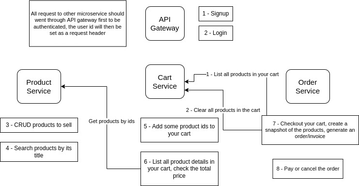

# niagael
E-commerce backend API. The title sounds weird, honestly. It's just [the equivalent of "e-commerce" in bahasa](https://twitter.com/ivanlanin/status/846681485750878208). I kinda regret it, but changing the name would require quite some effort to change a couple of variable names.

## Features and Limitations
- Create an account identified with username, password, and display name
- CRUD operations for products to be sold
- Search products by its titles
- Add some products to your shopping cart
- Each user only have one cart
- List all product details in your cart, see the total price of the products in your cart
- Checkout all the products in your cart; create a payment order/invoice
- Pay or cancel your payment order

## Flow diagram


## Running the server
```
docker-compose up
```

## Sample Requests
The flow can be followed by looking at the number in front of every request title in the postman collections, i.e. 1st is signup, 2nd is login, and so on.  
Postman collection: https://www.getpostman.com/collections/0db38d5bff917d1ef943

## Demo
[Video link](https://drive.google.com/file/d/1QW1ZB1IBC_WhRC3JFTuPZx50TzDPkKLc/view?usp=sharing). You might have to download the video first to watch it in higher resolution.